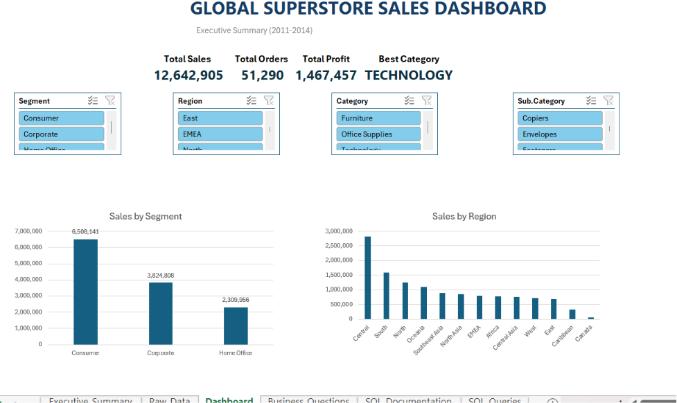
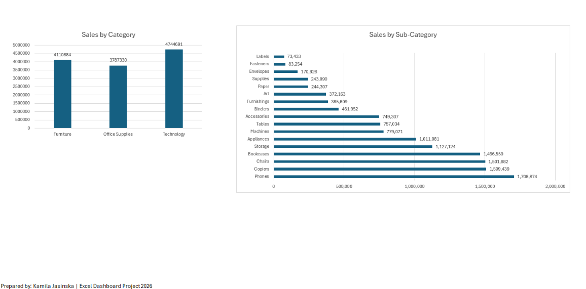
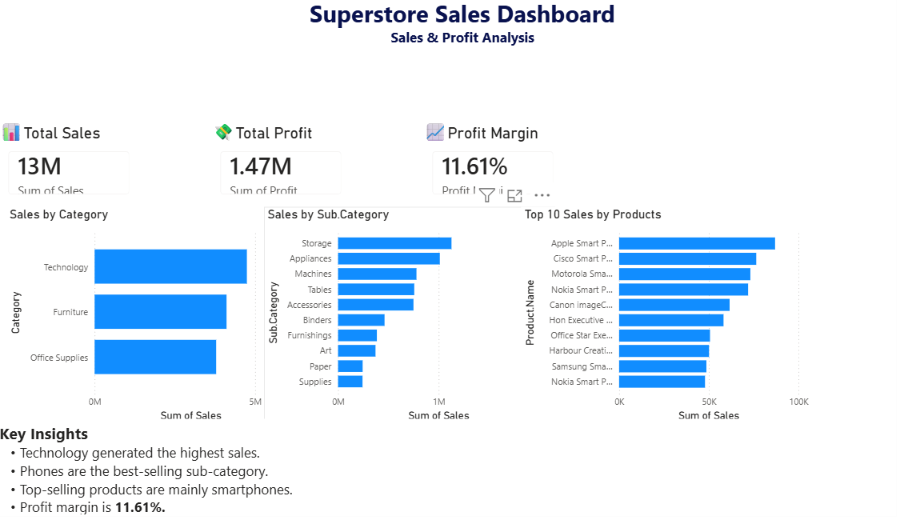
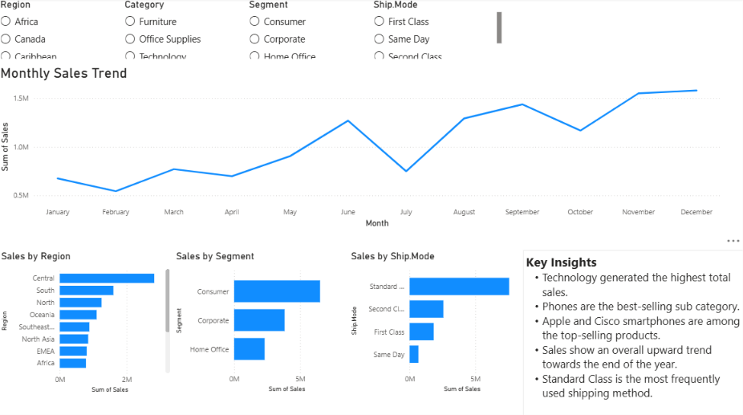

# Superstore_Sales_Analysis
Sales analysis project using Excel and Power BI.

# Superstore Sales Analysis

Sales analytics project using Excel and Power BI.

# Project Overview

This project analyses sales performance, profit and customer segments using Superstore data.

The project was completed using:

- Microsoft Excel
- Power BI

The objective was to identify the most profitable categories, products, customer segments and sales trends.

---

# Dashboard KPIs

- Total Sales: **£13M**
- Total Profit: **£1.47M**
- Profit Margin: **11.61%**

---

# Key Insights

- Technology generated the highest sales.
- Phones were the best-selling sub-category.
- Apple and Cisco smartphones were among the top-selling products.
- Consumer customers generated the highest revenue.
- Standard Class was the most frequently used shipping method.
- Sales increased steadily towards the end of the year.

---

# Dashboard Screenshots

### Executive Dashboard

### Detailed Sales Analysis

